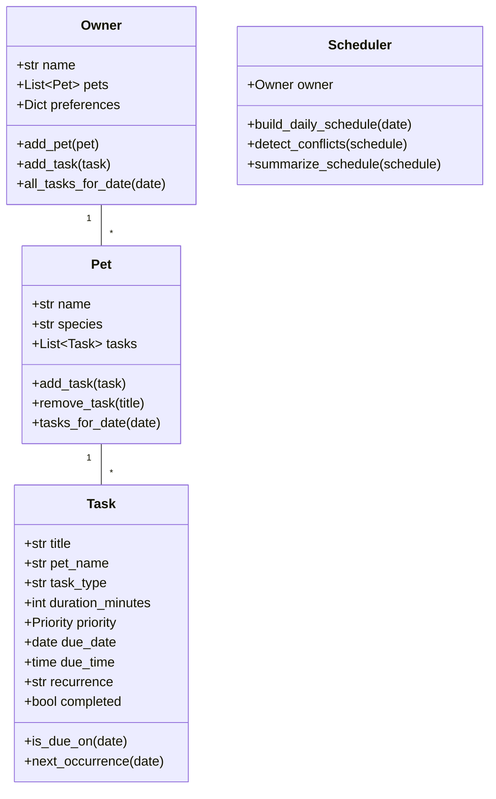

# PawPal+ Project Reflection

## 1. System Design

**a. Initial design**

- Owner: manages pets and maps tasks to pets. Encapsulates owner preferences and the API that supports system operations.
- Pet: stores pet data (name, species, age, medical notes) and holds task list. Has methods to add/remove tasks and query per-date tasks.
- Task: data class representing a pet care event (feeding, walk, medication, appointment) with attributes like duration, priority, due date/time, recurrence, and completion state.
- Scheduler: builds a daily timeline by collecting tasks for each pet and performing sorting/prioritization, conflict detection, and simple availability-based placement.

Mermaid UML diagram:

**b. Design changes**

- Initially I planned only fixed and flexible tasks; I added recurrence and conflict detection after writing the first scheduler draft to align with assignment requirements.
- Added `ScheduledTask` as a projection object in Scheduler so `Task` stays domain-focused and scheduler outputs are clearly timed objects.

---

## 2. Scheduling Logic and Tradeoffs

**a. Constraints and priorities**

The scheduler considers task due times (for chronological ordering), priorities (High/Medium/Low to rank urgency), pet assignments (to group and separate tasks per pet), and recurrence patterns (to handle daily/weekly/monthly auto-creation). It prioritizes fixed-time tasks first (placed at exact due_time), then slots flexible tasks into remaining windows sorted by priority and estimated time. I decided these constraints mattered most because they align with real pet care needs: time-sensitive routines (feedings, walks), urgency (medications over playtime), pet-specific care, and recurring maintenance without manual re-entry.

**b. Tradeoffs**

I chose a lightweight conflict model that checks exact time overlaps in scheduled timeslots, rather than a full interval graph with partial overlap and flexible granular rescheduling. This keeps the system simple to reason about and perform in a small CLI app, while still catching the most common collision cases (same-hour tasks for the same or multiple pets).

---

## 3. AI Collaboration

**a. How you used AI**

- Used Copilot to draft the class diagrams and initial `pawpal_system.py` skeleton, then iterated in agent mode for method definitions.
- Used AI for algorithm ideas: task sorting by timezone, recurrence rules, conflict detection, plus test generation and fix guidance in pytest.
- Helpful prompts included: "Suggest a schedule conflict detection implementation" and "How to map Owner->Pet->Task in a clean API".

**b. Judgment and verification**

- I rejected a Copilot suggestion that tried to optimize scheduling with a complicated graph search; I kept a simpler greedy-fixed/flexible approach for clarity and reliable behavior.
- Verified by running `python -m pytest` and checking the schedule output in `main.py`/`app.py` against expected order and conflict states.

---

## 4. Testing and Verification

**a. What you tested**

- Verified sorting so tasks appear in chronological order by due time, with flexible tasks last.
- Verified that completing a daily task via `Task.mark_complete` creates the next-day task automatically.
- Verified conflict detection returns warnings when tasks have overlapping scheduled times.

**b. Confidence**

- 4/5: Base functionality is solid with current tests, but more edge cases could be added (monthly end-of-month behavior, multi-day scheduling, user persistence).

---

## 5. Reflection

**a. What went well**

- Structuring the backend as OOP classes made integration with Streamlit easy; separation of concerns kept app code simple.
- Copilot helped accelerate the bulk of boilerplate and interface scaffolding while I focused on correctness.

**b. What you would improve**

- Add persistence (JSON or database) so session state isn't lost when Streamlit restarts.
- Add a more robust conflict resolver that suggests alternative slots rather than only warning.

**c. Key takeaway**

- Being the lead architect means setting clear goals, reviewing AI outputs critically, and choosing maintainability over cleverness. AI accelerates implementation, but validation with tests and intentional design decisions still matters.
